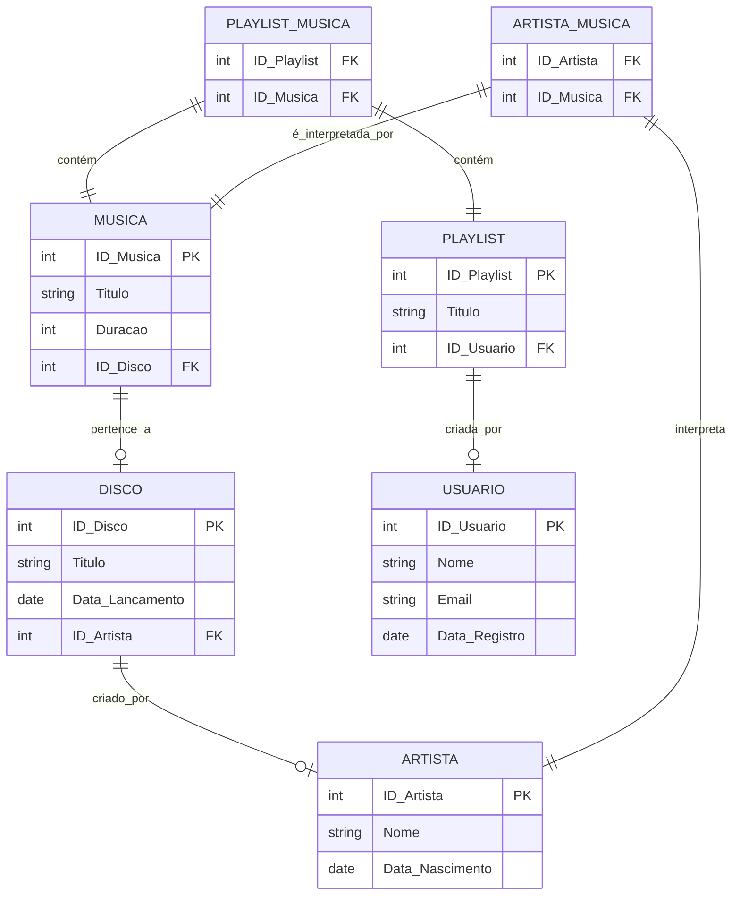

# Projeto 1: Sistema de Streaming de Música

Feito por: Bruno Arthur Basso Silva | Gabriela Molina Ciocci 
 
RA: 22.123.067-5 | 22.222.032-9 
 
Disciplina: CC5232 - Banco de Dados
 
Coordenador(a): Leonardo Anjoletto Ferreira
 
Ciclo: 5° Semestre. 
 
Curso: Ciência da Computação
 
Universidade: Centro Universitário FEI

======================================================================================================================================================

Certifique-se de criar o Banco de Dados e respectivas tabelas antes de utilizar o código.
 
O arquivo que contém as Queries de criação de tabelas no Banco de Dados chama-se "Queries SQL para Criação de Tabelas.txt".
 
O arquivo que contém as Queries para as 20 questões de Álgebra Relacional chama-se "Queries SQL para Álgebra Relacional.txt".

======================================================================================================================================================

CÓDIGO PARA CRIAÇÃO DE DADOS ALEATÓRIOS:

Para utilizar o código, é obrigatório que os arquivos de texto estejam na mesma pasta que o programa em Python, são eles:

   -> usuarios.txt
    
   -> artistas.txt
    
   -> musicas.txt
    
   -> playlists.txt

Ao baixar todos os arquivos e colocá-los no mesmo local, então você poderá executar o código.
 
Para definir a quantidade de cada item que será gerado, você precisará descer até as últimas linhas do código onde estão localizadas as variáveis que armazenam o valor de cada item que será gerado.
 
Após definir os valores desejados, você poderá rodar o programa.
 
Neste momento, será mostrado um menu contendo todas as informações dos alunos envolvidos e da disciplina.
 
Ao apertar enter, o programa irá gerar dados aleatórios e criará um novo arquivo de texto contendo todos os itens gerados:

   -> codeSQL.txt

Você poderá fechar o programa após a criação do arquivo.
 
Neste arquivo contém as Queries para adição dos dados no banco de dados.
 
Para adicioná-las, basta abrir o arquivo "codeSQL.txt", copiar todo seu conteúdo e colar no terminal do SQL.

======================================================================================================================================================

MODELO ENTIDADE RELACIONAL (MER):

======================================================================================================================================================

MODELO RELACIONAL (3FN):

Com base nos atributos e relacionamentos, temos o seguinte modelo relacional:

Musica

    ID_Música (PK)
    Título
    Duração
    ID_Disco (FK)

Artista

    ID_Artista (PK)
    Nome
    Data_Nascimento

Disco

    ID_Disco (PK)
    Título
    Data_Lancamento
    ID_Artista (FK)

Usuário

    ID_Usuário (PK)
    Nome
    Email
    Data_Registro

Playlist

    ID_Playlist (PK)
    Título
    ID_Usuário (FK)

Playlist_Música

    ID_Playlist (FK)
    ID_Música (FK)

Artista_Música

    ID_Artista (FK)
    ID_Música (FK)

Observações sobre a normalização
 
1NF (Primeira Forma Normal): Todos os atributos devem ter valores atômicos, e as tabelas devem ter uma chave primária definida.
 
2NF (Segunda Forma Normal): Todos os atributos não-chave devem depender completamente da chave primária, não apenas de parte dela.
 
3NF (Terceira Forma Normal): Não deve haver dependências transitivas, ou seja, atributos não-chave devem depender apenas da chave primária e não de outros atributos não-chave.
 

